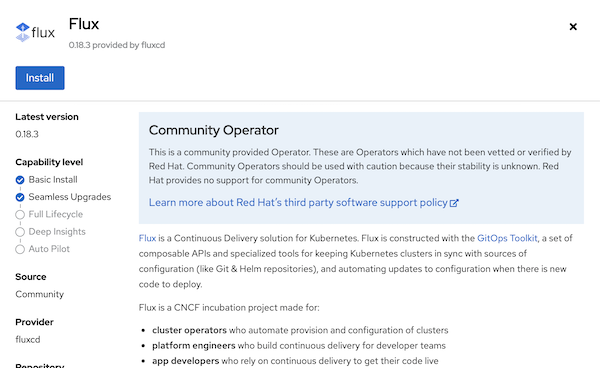
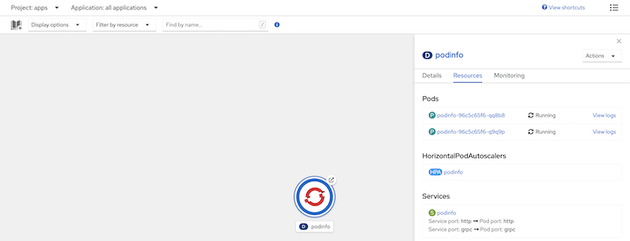
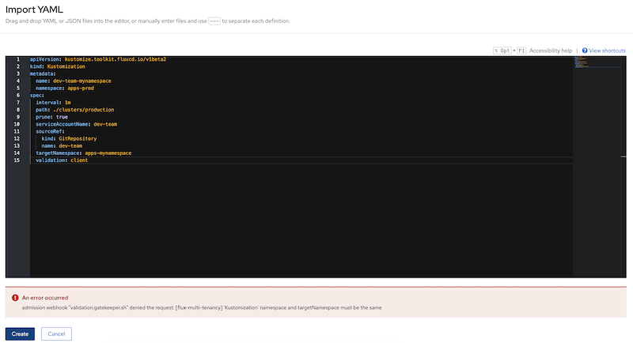

# Flux multi-tenancy demo for OpenShift

A multi-tenancy demon of [Flux](https://www.weave.works/oss/flux/) for [OpenShift](https://www.redhat.com/en/technologies/cloud-computing/openshift). This work has been derived from the original Flux multi-tenancy example, found [here](https://github.com/fluxcd/flux2-multi-tenancy).

## Overview

One of the key features of OpenShift is that it emphasizes robust security practices and multi-tenancy. Flux will be used to employ GitOps strategies by enforcing cluster configurations as well as the deployment of resources in multiple namespaces (single cluster or multiple).

### Personas

There are multiple persons that are accompanied in this demonstration. Each persona is also assigned to an OpenShift Group with appropriate RBAC policies for the level of access needed. The following table provides an overview of the users and the associated properties

| User | Group | Description |
| ---- | ----- | ----------- |
| alice | `platform-team` | Has `cluster-admin` level access and manages the OpenShift platform |
| john | `dev-team` | Developer responsible for resources in the `apps` project (employed via GitOps) |
| frank | `dev-team-prod` | SRE responsible for resources in the `apps-prod` project (employed via GitOps) |

## Deployment

### Prerequisites

Them following prerequisites must be satisfied before proceeding with the deployment and configuration of resources.

1. OpenShift environment with `cluster-admin` level access
2. Users and groups associated with the associated policies mapped according the the table defined above

### Flux Deployment

Flux is available as an operator on OperatorHub and can be deployed through the **OpenShift Web Console**. Alternatively, the manifests can be applied using the `kubectl` or `oc` command line tools.

The setup and configuration of Flux is managed by alice, as a platform manager.

Using the web console, login to OpenShift and select **Operators** -> **OperatorHub** from the lefthand menu.

Search for **Flux** and click **Install**. Leave all options as provided and select **Install** to deploy the Operator. The Operator will then be installed into the `flux-system` project.



Flux will then be installed into the `flux-system` namespace.

### Infrastructure Deployment

Once the Flux Operator has been deployed, the first steps is to set up the base infrastructure that is required by the Platform team. This includes:

* Add the Git repository containing the source code
* Deployment of a policy engine of choice. Options available are [Gatekeeper Operator](https://github.com/gatekeeper/gatekeeper-operator) or [Kyverno](https://kyverno.io/)
* Policies to enforce Flux policies are deployed to the appropriate namespace.

The process to deploy involves applying three (3) flux resources:

1. `GitRepository` representing the Git source resources will be obtained from
2. `Kustomization` associated with configuring the integration between OpenShift Monitoring and Flux
3. `Kustomization` representing the Policy Engine.

Using the Web Console or the command line, using the following steps to apply the following configurations which are located in the `cluster/infrastructure` directory.

First, add the `GitRepository` associated with the source code:

```yaml
apiVersion: source.toolkit.fluxcd.io/v1beta1
kind: GitRepository
metadata:
  namespace: flux-system
  name: platform-team
spec:
  timeout: 20s
  gitImplementation: libgit2
  interval: 1m
  url: "https://github.com/sabre1041/platform-team"
  ref:
    branch: gitopsdays
```

Next, deploy the `Kustomization` to deploy the integration between Flux and OpenShift Monitoring:

```yaml
apiVersion: kustomize.toolkit.fluxcd.io/v1beta2
kind: Kustomization
metadata:
  namespace: flux-system
  name: platform-flux-monitoring
spec:
  timeout: 2m
  path: ./clusters/infrastructure/flux
  interval: 5m
  prune: true
  force: false
  sourceRef:
    name: platform-team
    kind: GitRepository
```

Finally, deploy **one** of the following policy engines:

**Kyverno**

```yaml
apiVersion: kustomize.toolkit.fluxcd.io/v1beta2
kind: Kustomization
metadata:
  namespace: flux-system
  name: multi-tenant-infrastructure-kyverno
spec:
  timeout: 2m
  path: ./clusters/infrastructure/kyverno
  interval: 5m
  prune: true
  force: false
  sourceRef:
    name: platform-team
    kind: GitRepository
```

**Gatekeeper**

```yaml
apiVersion: kustomize.toolkit.fluxcd.io/v1beta2
kind: Kustomization
metadata:
  namespace: flux-system
  name: multi-tenant-infrastructure-gatekeeper
spec:
  timeout: 2m
  path: ./clusters/infrastructure/gatekeeper
  interval: 5m
  prune: true
  force: false
  sourceRef:
    name: platform-team
    kind: GitRepository
```

After a few moments, all of the resources will be installed to the cluster.

If you have the [Flux CLI](https://fluxcd.io/docs/cmd/) installed, you can view the deployed resources. Depending on the policy engine that was chosen, your output may look slightly different:

```shell
flux get all -n flux-system
```

```shell
NAME                            READY   MESSAGE                                                                                 REVISION                                                        SUSPENDED 
gitrepository/platform-team     True    stored artifact for revision 'gitopsdays/5eb4f6dbcc59a28777fdabcafe2ca609c4d28253' gitopsdays/5eb4f6dbcc59a28777fdabcafe2ca609c4d28253        False    

NAME                                                    READY   MESSAGE                                                                         REVISION                                                        SUSPENDED 
kustomization/flux-monitoring                           True    Applied revision: gitopsdays/5eb4f6dbcc59a28777fdabcafe2ca609c4d28253      gitopsdays/5eb4f6dbcc59a28777fdabcafe2ca609c4d28253        False    
kustomization/multi-tenant-infrastructure-kyverno       True    Applied revision: gitopsdays/5eb4f6dbcc59a28777fdabcafe2ca609c4d28253      gitopsdays/5eb4f6dbcc59a28777fdabcafe2ca609c4d28253        False    
kustomization/platform-flux-monitoring                  True    Applied revision: gitopsdays/5eb4f6dbcc59a28777fdabcafe2ca609c4d28253      gitopsdays/5eb4f6dbcc59a28777fdabcafe2ca609c4d28253        False    
kustomization/policies-kyverno                          True    Applied revision: gitopsdays/5eb4f6dbcc59a28777fdabcafe2ca609c4d28253      gitopsdays/5eb4f6dbcc59a28777fdabcafe2ca609c4d28253        False    
kustomization/policy-engine-kyverno                     True    Applied revision: gitopsdays-/5eb4f6dbcc59a28777fdabcafe2ca609c4d28253      gitopsdays/5eb4f6dbcc59a28777fdabcafe2ca609c4d28253        False    
```

### Staging Application Deployment

The platform team is responsible for managing the deployment of an application across multiple environments. These environments can be two namespaces on a single cluster or in separate clusters (we will assume a single cluster here).

`john` is a member of the development tam who is looking to have an application deployed to a namespace called `apps` for which he will be able to manage.

While logged in as `alice`, apply the staging configuration found in [deployment/staging.yaml](deployment/staging.yaml) and apply the manifest using the web console or CLI. The manifest is shown below:

```yaml
apiVersion: kustomize.toolkit.fluxcd.io/v1beta2
kind: Kustomization
metadata:
  namespace: flux-system
  name: multi-tenant-staging
spec:
  timeout: 2m
  path: ./clusters/staging
  interval: 5m
  prune: true
  force: false
  sourceRef:
    name: platform-team
    kind: GitRepository
```

After a few moments, a new namespace called `apps` will be created and an application will be deployed.

Login as `john` to confirm that he has access to the `apps` project an view the application from _Topology view_ in the **Developer Perspective**



An OpenShift _Route_ has been configured to expose the application. Click on the link to view the application.

### Production Application Deployment

The platform team is also responsible for deploying the application to the production environment. Login again as `alice` to apply the Flux policies to enable the deployment. The manifest is located in the [deployment/production.yaml](deployment/production.yaml) file as shown in the snippet below:

```yaml
apiVersion: kustomize.toolkit.fluxcd.io/v1beta2
kind: Kustomization
metadata:
  namespace: flux-system
  name: multi-tenant-production
spec:
  timeout: 2m
  path: ./clusters/production
  interval: 5m
  prune: true
  force: false
  sourceRef:
    name: platform-team
    kind: GitRepository
```

Use the OpenShift web console or CLI to apply the manifest to the cluster.

Login as `frank` who is an SRE and responsible for managing production applications. Flux will create a namespace called `apps-prod` containing the application. Confirm that `frank` can only see the `apps-prod` and not the `apps` project which demonstrates full multi tenancy!


## Policy Enforcement

Whether Kyverno or Gatekeeper was chosen as the policy engine implementation, either will act as an enforcement point for ensuring the appropriate security within the environment. In order to maintain appropriate multitenancy, these engines will prevent Flux resources from specifying a `targetNamespace` which differs from the `namespace`.

A sample policy to test this policy can be found in the [testing/policy-enforcement.yaml](testing/policy-enforcement.yaml) file and can be found below:

```yaml
apiVersion: kustomize.toolkit.fluxcd.io/v1beta2
kind: Kustomization
metadata:
  name: dev-team-mynamespace
  namespace: apps-prod
spec:
  interval: 1m
  path: ./clusters/production
  prune: true
  serviceAccountName: dev-team
  sourceRef:
    kind: GitRepository
    name: dev-team
  targetNamespace: apps-mynamespace
  validation: client
```

While logged in as `alice`, using the OpenShift Web Console or CLI, attempt to create the resource in OpenShift. Attempting to create the resource will result in an error as it violates the policy.



This confirms policies are being enforced appropriately .

## Monitoring

OpenShift includes a set of monitoring components consisting of Prometheus, Thanos and Grafana. As part of the deployment performed earlier, configurations were performed to enable OpenShift monitoring (specifically Prometheus) to scape metrics endpoints that are exposed by each of the Flux components. These metrics can be viewed by either navigating to the included Prometheus instance that is available or by accessing the **Metrics** page within the OpenShift Web Console by navigating to **Observe** -> **Metrics**.

The following queries can be used to visualize the operational statistics of the Flux environment.

### Reconciler Statistics

```
gotk_reconcile_condition{kind=~"Kustomization|HelmRelease",status="False",type="Ready"}
```

### Reconciler Operations Average Duration

```
  sum(rate(gotk_reconcile_duration_seconds_sum{namespace=~"flux-system",kind=~"Kustomization|HelmRelease"}[5m])) by (kind)
/
  sum(rate(gotk_reconcile_duration_seconds_count{namespace=~"flux-system",kind=~"Kustomization|HelmRelease"}[5m])) by (kind)
```

### Source Operations Average Duration

```
  sum(rate(gotk_reconcile_duration_seconds_sum{namespace=~"flux-system",kind=~"GitRepository|HelmRepository|Bucket"}[5m])) by (kind)
/
  sum(rate(gotk_reconcile_duration_seconds_count{namespace=~"flux-system",kind=~"GitRepository|HelmRepository|Bucket"}[5m])) by (kind)
```

### CPU Statistics

```
rate(process_cpu_seconds_total{namespace="flux-system",pod=~".*-controller-.*"}[1m])
```

### API Requests

```
sum(rate(rest_client_requests_total{namespace="flux-system",pod=~".*-controller-.*"}[1m]))
```
